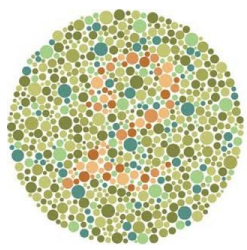
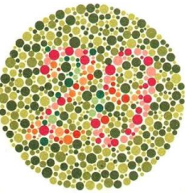
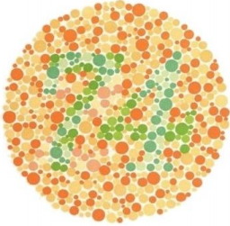
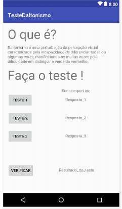
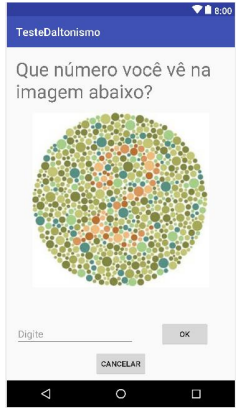

# appTesteDaltonismo 
:warning: This project is a prototype

# Daltonismo 
é uma perturbação da
percepção visual caracterizada pela
incapacidade de diferenciar todas ou
algumas cores. Em geral dificuldade de distinguir o verde do
vermelho. É uma perturbação que tem normalmente
origem genética, mas pode também
resultar de lesão nos olhos, ou de lesão de
origem neurológica.

• Existem três métodos para se diagnosticar a
presença do daltonismo e determinar em
que grau ele está afetando a percepção das
cores de uma pessoa:
• Anomaloscópio de Nagel
• Lãs de Holmgreen
• Teste de cores de Ishihara

  
  
  

 

  
  

 
